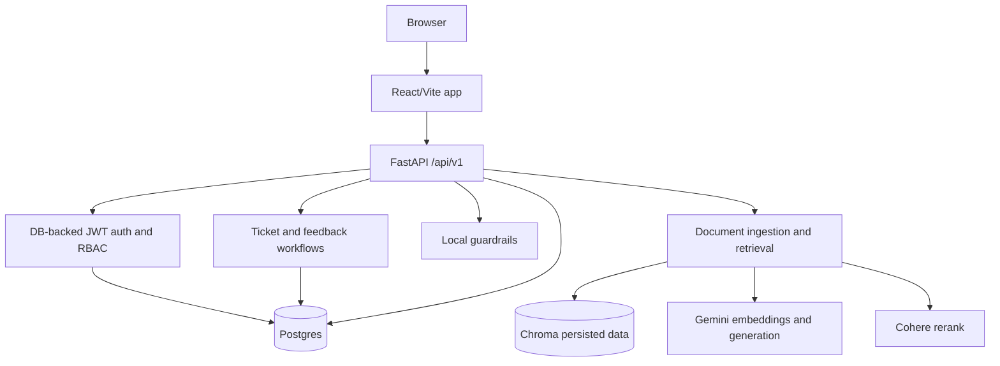

# Architecture

## Overview

HR Helpdesk AI is a FastAPI API plus a React/Vite frontend. The pilot production target is one Docker host running the backend image, Postgres, and persistent local Chroma data.

## Backend

- Entry point: `backend/app/main.py`.
- API base: `/api/v1`.
- Local/dev startup may create tables and seed demo users.
- Production startup skips table creation and demo seeding; deploys must run `alembic upgrade head`.
- Auth uses signed JWTs, then resolves the current user from the database for protected endpoints. Development/test can still accept token-only users for fixture coverage.
- Guardrails are local deterministic rules in `backend/app/services/guardrails.py`. They block jailbreak attempts, out-of-scope questions, and sensitive requests for other people's private HR data.
- Chat escalation is confirmation-based: the chat API returns an `escalation_confirmation_required` action, and the frontend asks the user before creating a ticket.
- Ticket APIs:
  - `POST /api/v1/escalations` creates a ticket after user confirmation or direct ticket submission.
  - `GET /api/v1/tickets` returns the current user's own tickets.
  - `GET /api/v1/admin/tickets` and `PATCH /api/v1/admin/tickets/{ticket_id}` are HR-admin-only ticket management endpoints.

## RAG

- Uploads flow through `backend/app/services/documents.py`.
- Documents are loaded, normalized, section-aware chunked, embedded, and stored in Chroma.
- API-driven ingestion also mirrors document/chunk metadata into SQL tables for auditability.
- Retrieval uses hybrid semantic and lexical scoring, applies role/department filters, gates low-confidence citations, then reranks the candidate set with Cohere before returning citations.
- Cohere rerank uses `COHERE_API_KEY` and defaults to `rerank-v4.0-pro`; local tests skip external rerank calls.
- In production, Gemini configuration is required; local sparse fallback is reserved for development/tests.

## Frontend Workflows

- React/Vite lives under `frontend/`.
- The chat UI streams answers, renders citations, and shows explicit `Gửi ticket` / `Không gửi` controls for escalation confirmation.
- The admin dashboard reads real API data from tickets, documents, and TrendPins. It does not use hardcoded KPI mock data.
- Admin ticket management reads from `/api/v1/admin/tickets`; employee ticket history reads from `/api/v1/tickets`.
- Knowledge base upload/list/delete and trend pin views use production API endpoints instead of demo-only state.

## Data

- Postgres is the production database for users, refresh tokens, chat sessions/messages, tickets, feedback, query logs, and document metadata.
- Chroma persists vector data under `CHROMA_PERSIST_DIR`.
- SQLite remains supported for local development and test isolation.

## Deployment

- Docker image builds Python dependencies and the React frontend.
- Container command runs Alembic migrations before starting Uvicorn.
- Compose includes a Postgres service and persistent volumes.
- Health endpoints:
  - `/health` basic compatibility check
  - `/health/live` liveness
  - `/health/ready` database/vector/model readiness

## Security Notes

- `APP_ENV=production` requires a strong `JWT_SECRET_KEY`, explicit CORS allowlist, Gemini API key configuration, and `COHERE_API_KEY` for reranking.
- Demo users are never auto-seeded in production.
- Refresh tokens are stored and revoked in the database.
- User authorization decisions should use the DB-backed dependency in `backend/app/api/deps.py`.
- Groq is not part of the current guardrail path; guardrail decisions are local rules only.
