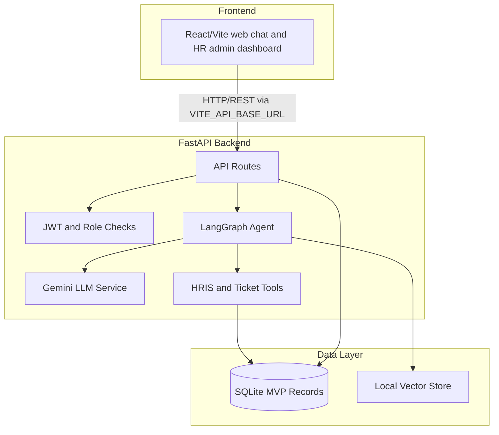
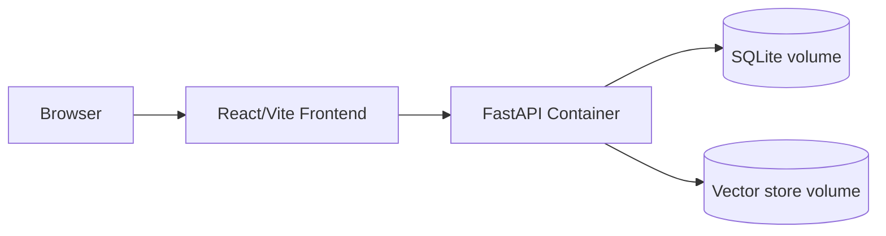

# Architecture Document

## System Overview

HR Helpdesk AI is a FastAPI API with a LangGraph agent core. The product will combine HR policy retrieval, cited answers, RBAC guardrails, safe mock HRIS function calls, escalation tickets, and trending summaries behind a contract-first HTTP API.

## Architecture Diagram

## Components

### 1. Frontend

- Purpose: employee chat and HR admin workflows.
- Implementation: React 18 + Vite + TypeScript in `frontend/`.
- Dev server: `cd fontend && npm run dev`, served at `http://localhost:3000/app/`.
- Key features: login, cited answers, trend pins, tickets, document management, feedback.
- State management: React hooks/context for v1.
- Backend fallback: FastAPI still serves a static HTML fallback at `/app`.

### 2. Backend

- Purpose: validate requests, expose the contract in `flow/05-contract.md`, and serve OpenAPI docs.
- API design: REST over FastAPI.
- Authentication: JWT with role claims in later cards; C-001 only establishes the scaffold.

### 3. AI Agent

- Agent type: LangGraph workflow.
- State: user query, role context, retrieval results, tool results, refusal or escalation state.
- Nodes planned: guardrail check, retrieval, HR metric lookup, answer generation, escalation.
- Tools planned: document retrieval, mock HRIS read adapter, ticket creation, trending summary.

### 4. Data Storage

- MVP records: SQLite for users, tickets, query logs, feedback, and document metadata.
- Vector store: local Chroma-style store for document chunks and citation metadata.
- Migration path: Postgres with pgvector when production deployment needs stronger persistence.

### 5. Model Layer

- Generation model: Gemini configured by `MODEL_NAME`.
- Embedding model: Gemini Embedding 2 configured by `EMBEDDING_MODEL_NAME`.
- Tests use deterministic local behavior unless a real API key is explicitly configured.

## Data Flow

1. User sends a request from the web UI.
2. FastAPI route validates input and auth context.
3. LangGraph routes the request through guardrails, retrieval, function calling, or escalation.
4. Gemini generates an answer only from allowed context.
5. API returns a contract-shaped response with citations, actions, or ticket id.

## Deployment Architecture

## Security

- API keys are loaded from `.env` and never committed.
- Input validation uses Pydantic.
- CORS is configurable by environment.
- Role filters must be applied before retrieval/generation in later cards.
- Personal HR metrics must be read through a safe adapter, not arbitrary employee ids.

## Design Decisions

| Decision | Choice | Reason |
|---|---|---|
| Backend | FastAPI | Async, typed schemas, built-in OpenAPI |
| Agent | LangGraph | Explicit routing for RAG, tools, refusal, and escalation |
| MVP records | SQLite | Simple local persistence for the first demo |
| Vector storage | Local vector store | Fast enough for policy-document MVP |
| Models | Gemini generation and embeddings | Matches project requirement |
