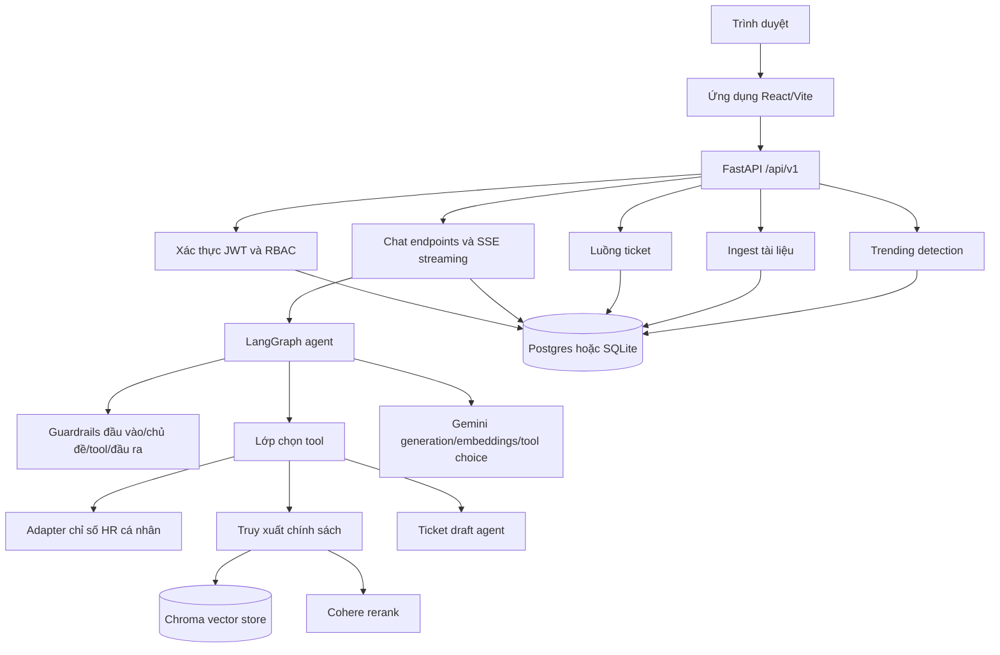

# Kiến trúc

## Tổng quan

HR Helpdesk AI gồm backend FastAPI và frontend React/Vite. Backend chịu trách nhiệm xác thực, điều phối chat, ingest tài liệu, truy xuất RAG, guardrails, ticket, trending detection và health checks. Frontend là giao diện helpdesk nội bộ có phân quyền theo vai trò, gọi API dưới `/api/v1`; khi phát triển có thể chạy riêng bằng Vite, còn khi deploy có thể được phục vụ từ backend tại `/app`.

Mục tiêu production pilot là một Docker host chạy backend image, Postgres và dữ liệu Chroma persist cục bộ.

```mermaid
graph TB
    Browser[Trình duyệt] --> Frontend[Ứng dụng React/Vite]
    Frontend --> API[FastAPI /api/v1]
    API --> Auth[Xác thực JWT và RBAC]
    API --> Chat[Chat endpoints và SSE streaming]
    Chat --> Agent[LangGraph agent]
    Agent --> Guardrails[Guardrails đầu vào/chủ đề/tool/đầu ra]
    Agent --> Tools[Lớp chọn tool]
    Tools --> HRIS[Adapter chỉ số HR cá nhân]
    Tools --> RAG[Truy xuất chính sách]
    Tools --> Draft[Ticket draft agent]
    RAG --> Chroma[(Chroma vector store)]
    RAG --> Cohere[Cohere rerank]
    Agent --> Gemini[Gemini generation/embeddings/tool choice]
    API --> Tickets[Luồng ticket]
    API --> Documents[Ingest tài liệu]
    API --> Trending[Trending detection]
    Auth --> DB[(Postgres hoặc SQLite)]
    Chat --> DB
    Tickets --> DB
    Documents --> DB
    Trending --> DB
```

## Ranh giới runtime

- `backend/app/main.py` tạo FastAPI app, mount `/static`, include `/api/v1`, expose `/health`, `/health/live`, `/health/ready`, và phục vụ frontend bundled/static tại `/app`.
- `backend/app/api/v1/router.py` nối các endpoint auth, chat, documents, tickets, trending, feedback và HR metrics.
- `frontend/src/lib/api.ts` là ranh giới API của frontend. Dev mode gọi `http://localhost:8000/api/v1`; production mode mặc định dùng `/api/v1`.
- `Dockerfile` build Python dependencies, build React frontend, copy `frontend/dist`, chạy Alembic migrations, rồi start Uvicorn.
- `docker-compose.yml` chạy backend image cùng Postgres và persist dữ liệu runtime qua `./data` và volume `postgres_data`.

## Phần backend

- Entry point: `backend/app/main.py`.
- API base: `/api/v1`.
- Khi chạy local/dev, startup có thể tự tạo bảng và seed demo users.
- Khi chạy production, startup bỏ qua tạo bảng và seed demo; deploy phải chạy `alembic upgrade head`.
- Auth dùng JWT access/refresh tokens có chữ ký. Các endpoint protected resolve current user từ database qua `backend/app/api/deps.py`.
- Backend expose role dưới dạng `employee`, `department_admin`, và `hr_admin`; các giá trị legacy trong DB được map bởi `backend/app/models/user.py`.
- Chat hỗ trợ cả request/response (`POST /chat`) và SSE streaming (`POST /chat/stream`).
- Chat sessions, messages, workflow state, query logs, feedback, refresh tokens, tickets và document metadata được persist trong SQL tables.

## Agent và luồng chat

Luồng chat được triển khai bằng LangGraph graph trong `backend/app/agents/graph.py`.

Các stage chính của graph:

1. `input_safeguard`
2. `topic_scope`
3. `classify_intent`
4. `hr_metrics`, `retrieve_policy`, `handle_ticket_intent`, hoặc `general_answer`
5. `answer_with_sources` hoặc `handle_no_source` khi có chạy retrieval
6. `output_safeguard`
7. `finalize_response`

Tool choice kết hợp rule routing deterministic với Gemini function-call style routing khi provider calls được bật. Các logical tool được hỗ trợ:

- `get_hr_metrics`
- `search_policy`
- `request_ticket_escalation`
- `answer_general`

Chat API cũng giữ session workflow state cho luồng tạo ticket nhiều lượt. Người dùng có thể bắt đầu tạo ticket, bổ sung thông tin còn thiếu, tạm dừng bằng cách hỏi câu HR khác, tiếp tục, hủy, hoặc xác nhận card ticket đã được chuẩn bị.

## RAG

- Upload tài liệu đi qua `backend/app/services/documents.py`.
- Các định dạng upload được hỗ trợ gồm `.docx`, `.md`, và `.txt`.
- Tài liệu được load, normalize, chunk theo section, embed, rồi lưu vào Chroma.
- Ingestion qua API cũng mirror document/chunk metadata vào SQL tables để audit.
- Retrieval dùng hybrid semantic và lexical scoring trong `backend/app/services/retrieval.py`.
- Candidate chunks được filter theo `visibility_roles` và `department_ids`.
- Cohere rerank được dùng sau hybrid scoring khi provider calls được bật và `COHERE_API_KEY` đã cấu hình.
- Ở production, cấu hình Gemini là bắt buộc; local sparse fallback chỉ dành cho development/tests khi strict online mode bị tắt.

## Guardrails

Guardrails nằm trong `backend/app/guardrails/` và được gọi từ các agent nodes.

- Input safeguard chặn prompt injection, yêu cầu không an toàn và truy cập dữ liệu nhạy cảm không được phép.
- Topic scope classifier giữ assistant trong phạm vi HR/helpdesk và có thể phân loại yêu cầu mơ hồ.
- Tool guardrail bảo vệ các thao tác có side effect và lookup chỉ số HR cá nhân.
- Output safeguard có thể block hoặc redact output không được hỗ trợ/nhạy cảm trước khi trả response.
- Rule-based checks luôn sẵn có. Provider checks tùy chọn có thể dùng Groq hoặc OpenAI, cấu hình bằng `SAFEGUARD_PROVIDER`.
- `GUARDRAILS_MODE=block` enforce quyết định; `warn` cho phép đi tiếp kèm logging; `off` tắt guardrail enforcement.

## Ticket

Ticket APIs:

- `POST /api/v1/escalations` tạo ticket sau khi người dùng xác nhận hoặc gửi ticket trực tiếp.
- `GET /api/v1/tickets` trả về ticket của current user.
- `GET /api/v1/admin/tickets` trả về dữ liệu quản lý ticket cho admin.
- `PATCH /api/v1/admin/tickets/{ticket_id}` cập nhật status/assignee.

Ticket có thể được tạo theo hai cách:

- Chat agent trả về `escalation_confirmation_required` khi câu trả lời no-source, outside-scope, sensitive hoặc low-confidence nên được chuyển HR xử lý.
- Ticket draft agent trả về `ticket_draft_confirmation` sau khi đã có đủ field có cấu trúc cho một support ticket do người dùng yêu cầu.

Việc tạo ticket thật vẫn là một action riêng cần người dùng xác nhận.

## Luồng frontend

- React/Vite nằm trong `frontend/`.
- `frontend/src/AppRoutes.tsx` gate routes dựa trên auth state và UI role đã map.
- Workflow employee/user gồm chat, resources, submit ticket, settings và lịch sử ticket của chính mình.
- Workflow HR admin gồm dashboard, knowledge base, ticket management và các action trending candidate/pin.
- Chat UI dùng `POST /chat/stream`, render citations, hiển thị action card cho ticket draft/escalation confirmation, và đọc/ghi chat sessions.
- Knowledge base upload/list/delete và trend pin views dùng API endpoints thật thay vì demo-only state.

## Kho dữ liệu

- Postgres là production database cho users, refresh tokens, chat sessions/messages, chat workflow state, tickets, feedback, query logs, document metadata và document chunk metadata.
- SQLite vẫn được hỗ trợ cho local development và test isolation.
- Chroma persist vector data dưới `CHROMA_PERSIST_DIR`.
- Thư mục `data/` là vị trí persist local mặc định cho SQLite và Chroma.

## Triển khai

- Docker image build backend dependencies và React frontend.
- Container command chạy Alembic migrations trước khi start Uvicorn.
- Compose gồm Postgres và persistent volumes.
- Production yêu cầu `JWT_SECRET_KEY` mạnh, `CORS_ORIGINS` rõ ràng, cấu hình Gemini, `COHERE_API_KEY`, và safeguard provider nếu guardrails vẫn gọi provider.

Health endpoints:

- `/health` kiểm tra tương thích cơ bản
- `/health/live` liveness
- `/health/ready` readiness cho database/vector/model

## Ghi chú bảo mật

- Demo users không bao giờ được auto-seed trong production.
- Refresh tokens được lưu và revoke trong database.
- Quyết định authorization nên dùng DB-backed dependency trong `backend/app/api/deps.py`.
- Retrieval tài liệu phải qua filter role và department trước khi citations được dùng.
- Personal HR metrics chỉ dành cho authenticated user hiện tại; yêu cầu xem chỉ số của người khác phải bị block hoặc handoff.
- Các action có side effect như tạo ticket yêu cầu user đã xác thực và xác nhận rõ ràng.
