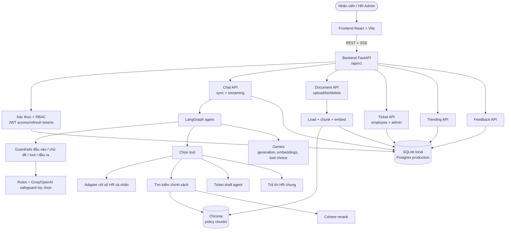
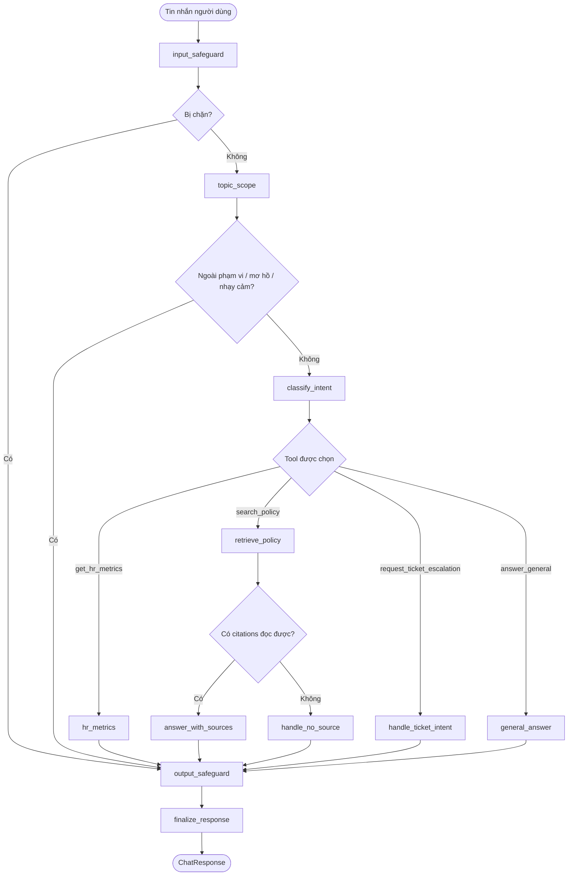
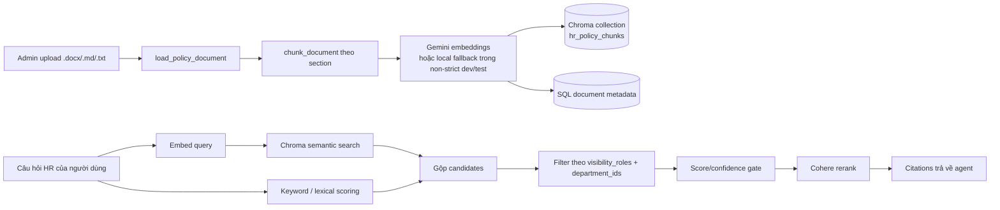
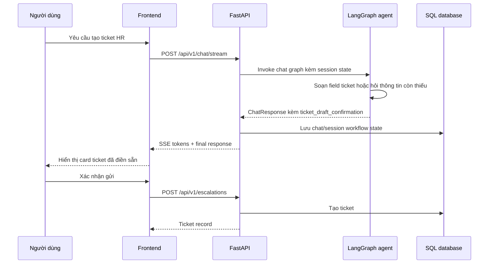

# Sơ đồ kiến trúc

## Tổng quan hệ thống

## Luồng chat agent

## Ingest và retrieval RAG

## Luồng ticket

## Chi tiết thành phần

| Thành phần | Công nghệ | Mục đích |
| --- | --- | --- |
| Frontend | React 18, Vite, TypeScript | Chat, knowledge base, tickets, admin dashboard theo vai trò |
| Backend API | FastAPI | REST/SSE API và phục vụ frontend bundled/static |
| Agent | LangGraph | Điều phối chat có trạng thái và routing |
| LLM | Gemini | Generation, embeddings, streaming, tool choice |
| Rerank | Cohere | Rerank retrieval candidates trước khi trả citations |
| Guardrails | Rules + provider Groq/OpenAI tùy chọn | Safety checks cho input/topic/tool/output |
| Database | SQLite/Postgres | Users, tokens, sessions, tickets, feedback, query logs, document metadata |
| Vector Store | Chroma | Lưu persistent policy chunk embeddings cho RAG |
| Triển khai | Docker, Docker Compose | Backend image có bundled frontend và Postgres |
